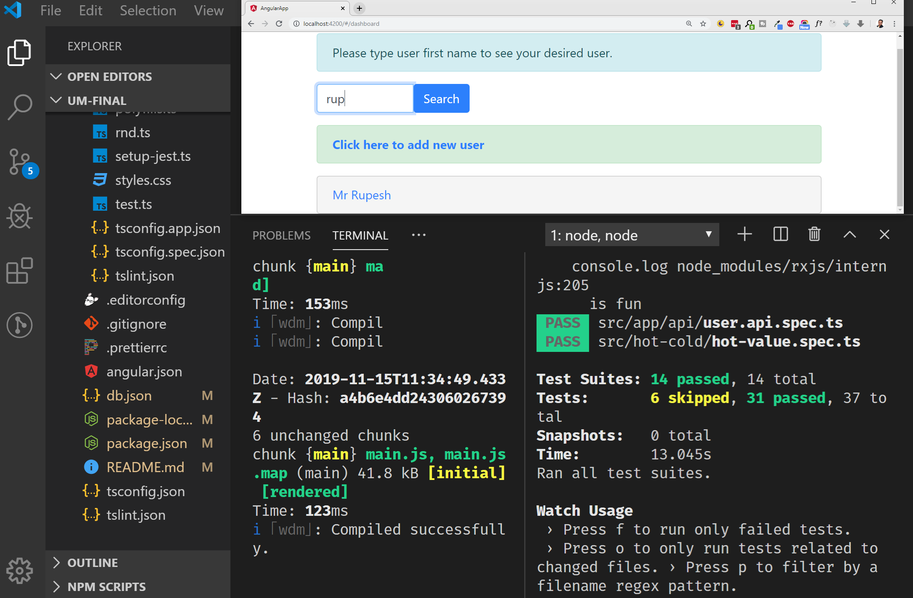

# ✨ Welcome to Unit Testing RxJS with Marble Diagrams

Welcome to `Unit Testing RxJS with Marble Diagrams` course excercise material portal. Please watch [Unit Testing RxJS with Marble Diagrams](https://app.pluralsight.com/library/courses/unit-testing-rxjs-marble-diagrams/table-of-contents) course in pluralsight.

👉 https://app.pluralsight.com/library/courses/unit-testing-rxjs-marble-diagrams/table-of-contents

## 💻 Angulr App

- ✅ Angular v8.2.14
- ✅ Jasmine-Marbles 0.4.1
- ✅ Typescript v3.4.4

## 👮 Scripts Status

- ✅ `npm start` is working
- ✅ `npm test` is working
- ✅ `npm run build` is working

## ☀️ What is Marble Diagrams

[Marble diagrams](https://rupeshtiwari.com/category/rxjs/marble-diagrams/) enables you to understand the behavior of RxJS observables and operators visually. It also helps to write unit test for asynchronous code in synchronous manner want to learn more please watch my course till the end.

## 💼 What will you get out of this course

- ✅ [Building blocks of RxJS](https://www.youtube.com/watch?v=0xwqbWgyfVs&list=PLZed_adPqIJrSTI1JeTIOCtqQNDDO44OF)

- ✅ Fundamentals of [Hot & Cold Observables](https://www.youtube.com/watch?v=YGzCaEy1-yI&list=PLZed_adPqIJrajWo0hMIk2I8HJBpF6VQA)

- ✅ [Marble Diagrams](https://www.youtube.com/watch?v=fyD4TziC7o0&list=PLZed_adPqIJooYNzb6YdKADYgWTr2HLFm) Concepts

- ✅ Marble Testing Syntaxes

- ✅ Introduction to `jasmine-marbles` library

- ✅ Unit Testing Observables & Operators using marble diagrams

- ✅ Mocking Observables using Marble Testing

## 🏃 Getting started ( Coding along Source Code )

- Make sure you are at here https://github.com/rupeshtiwari/UnitTesting-RxJS-Marble-Diagrams
- Click on `Clone or Download` button.
- Copy the Git clone URL `https://github.com/rupeshtiwari/UnitTesting-RxJS-Marble-Diagrams.git`
- In your box run below command to get the source code
- `git clone https://github.com/rupeshtiwari/UnitTesting-RxJS-Marble-Diagrams.git`
- Go to `UM-START` folder
- Delete `package-lock.json` file & `node_modules` folder if they exists.
- Open Terminal and run `npm i`
- To run the angular app please run command `npm start`
- To run unit tests please run command `npm test`

## 📣 Need help

If you find any issues please post a comment to this article [UnitTesting-RxJS-Marble-Diagrams Problem Solver](https://rupeshtiwari.com/unittesting-rxjs-marble-diagrams-problem-solver/) and I will reply with any updates to my github repository.
Thanks and happy coding 😃

## 💯 This Git Repostiory is maintained

I am trying my best to keep this repository live and working. I recently updated this repository to match with latest angular version.
Also did a quick test everything looks okay. Still if you find any issues please feel free to create issues or post a comment to [UnitTesting-RxJS-Marble-Diagrams Problem Solver](https://rupeshtiwari.com/unittesting-rxjs-marble-diagrams-problem-solver/) article.

## 💖 Want to Contribute

I will be happy to take any pull requests that you have to improve this code base. Thanks for your support 🙏
